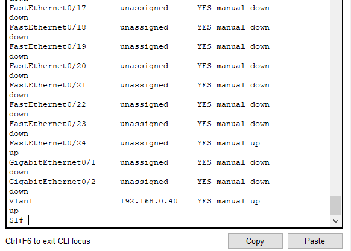

# Redes I 
## Indice
* [Actualizar Switch](#actualizar-switch)
* [Asignar nombre a un Dispositivo](#asignar-nombre)
* [Asigne Contraseña NO Cifrada del Modo EXEC Privilegiado](#asigne-Contraseña-no-cifrada-del-modo-exec-privilegiado)
* [Asigne Contraseña Cifrada del Modo EXEC Privilegiado](#asigne-Contraseña-cifrada-del-modo-exec-privilegiado)
* [Cancelar Operacion Cuando Ingresamos un Comando Incorrecto](#cancelar-operacion-comando-incorceto)
* [Desabilitar Busqueda DNS](#desabilitar-busqueda-dns)
* []()

## Mostrar Informacion de IP Router
```cli
R1# show ip interface brief
R1# show ipv6 interface brief
```
| Interface |  IP-Address (IP)  | OK? | Method | Status | Protocol |
| :---: | :---: | :---: | :---: | :---: | :---: |
| FastEthernet 0/0 | 192.168.0.1 |yes|Manual| up | up |
| FastEthernet 0/1 | unassigned |yes|Manual| Down | Down |
| Vlan1 | unassigned |yes|unset| Down | Down |


## Mostrar Tabla ARP en Windows
```bash
arp -a
```
| Internet Address (IP) | Physical Address (MAC) | Type |
| :---: | :---: | :---: |
| 192.168.0.1 | f8-1d-0f-eb-ec-92 | dynamic |
| 192.168.0.10 | 01-00-5e-00-00-fb | dynamic |
| 192.168.0.255 | ff-ff-ff-ff-ff-ff | static |

la direccion **192.168.0.255** es una direccion de difucion o **Broadcast**.

Asi mismo la MAC **ff-ff-ff-ff-ff-ff** indica a un Switch que envie una trama a todos los puertos menos al remitente.
## Mostrar Tabla ARP de Routers
```bash
arp -a
```

## Actualizar switch


### Nombre del archivo de actualizacion version 15 del sistema operativo
> c2960-lanbasek9-mz.150-2.SE4.bin

## Tener en cuenta
1. Deben establecer una IP para el servidor 


## Nos movemos a el CLI del Switch

## Verificar version
```cli
Switch> show version
```


## Habilitar la VLAN1 del Switch

Niveles de acceso requeridos

```cli
Switch> enable
Switch# configure terminal
```

Establecer una IP y encender la interfaz

```cli
Switch(config)# interface vlan1
Switch(config-if)# ip address "cualquier ip valida" "una marcara de red para la ip"
Switch(config-if)# ip address 192.168.0.40 255.255.255.0
Switch(config-if)# no shutdown
```
### Espesificar version y fuente de la actualizacion

Desde el modo **enable**

```cli
Switch# copy tftp: flash:
```

Aqui se ingresa la direccion IP del servidor

```cli
Address or name of remote host []?
``` 

Aqui indicamos el nombre del archivo de actualizacion tal como se encuentra en el servidor
```cli
Source filename []?
``` 

En respuesta a este mensaje damos enter
```cli
Destination filename [c2960-lanbasek9-mz.150-2.SE4.bin]?
``` 

## Establecer el archivo para el arraque del sistema

```cli
Switch(config)# boot system "nombre del archivo de actualizacion"

Switch(config)# boot system c2960-lanbasek9-mz.150-2.SE4.bin
```

Guardamos los cambios

* **write** o **wr** para guardar cambios 

```cli
Switch(config)# do write
```

## Reiniciar Switch
Desde modo **enable**
```cli
Switch# reload
```
## Al Reiniciar el Switch Veridicamos la version del sistema operativo
```cli
Switch> show version
```
**[⬆ Volver al Indice](#indice)**


## Cancelar Operacion Comando Incorrecto

Lo que sucede en realidad es que CLI interpreta un comando erroneo como una direccion DNS y empieza la busquedfa de esa "Direccion"

> podemos cancelar esa operacion con la siguiente combinacion de teclas **Ctrl + shift + 6**

**[⬆ Volver al Indice](#indice)**

## Desabilitar Busqueda DNS
en ocaciones queremos desactivar la busqueda dns dado que estamos ingresando comandos de practica y tendemos a equivocarnos en la escritura y al equicocarnos en ocaciones CLI interpreta comandos erroneos como direcciones DNS que queremos buscar esta busqueda tarda y no la podemos cancelar a menos que la allamos desactivado previamente o que ingresemos el comando **Ctrl + shift + 6**

comando para desabilitar la busqueda DNS
desde el modo de configuracion
```cli
R!(config)# no ip domain-lookup
```


**[⬆ Volver al Indice](#indice)**
 
## Asignar Nombre

Desde el Modo Configuracion Global
```cli
S1(config)# hostname "nombre sin espacios"

S1(config)# hostname switch_edificio_1

switch_edificio_1(config)#
```

**[⬆ Volver al Indice](#indice)**

## Asigne Contraseña Cifrada del Modo EXEC Privilegiado

> No es necesario el comando "login" como en la contraseña de modo EXEC de Usuario ">"

En este caso por defecto Siempre se solicitara la contrasela al intentar ingresar al modo "enable" "#" "EXEC Privilegiado"
```cli
R1(config)# enable secret "contraseña"

R1(config)# enable secret $45R1$%pass$company
```

**[⬆ Volver al Indice](#indice)**

## Asigne Contraseña NO Cifrada del Modo EXEC Privilegiado

```cli
R1(config)# enable password "contraseña"

R1(config)# enable password miroutercisco3
```
## Ver Contraseñas de un Dispositivo
si tenemos acceso a el modo 

## Ver estado e informacion basica de los puertos de un switch

```cisco
S1# show ip interface brief
```

